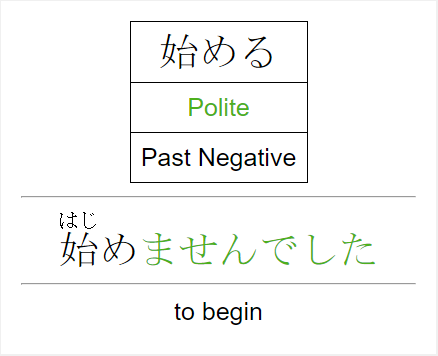

**Version - 1.0.1**

This add-on for Anki allows you to efficiently gather verb and adjective notes from your regular study decks and use them to generate decks aimed at practicing and studying various conjugations.

 

## Creating a Basic Study Deck

Use the regular deck creation dialog to create a new deck. In this example, we're creating a deck for verb conjugations, so we name it accordingly.

In the `Tools` menu, select `Japanese Conjugations` -> `Create/Update Verbs`. This will begin a short dialog. You must first select the deck where the conjugation notes will be placed. Choose the deck that you created earlier.

Now select the deck that will provide the **source** content. In this case, the source content are notes with verbs in their dictionary form. Note that source content is not modified so as to avoid negatively impacting any of your existing material and scheduling.

Congratulations! You should now have a study deck with individual cards dedicated to specific conjugations. As you add more vocabulary to your source deck(s), you can skip over the deck creation and use the same menu selections to update the conjugation deck with the new words.

## Creating a Filtered Study Deck

At times, you may wish to focus your conjugation studying on particular forms (maybe you have a quiz coming up, or you are just feeling rusty/slow on a set of forms). This addon provides a customized start to creating a filtered deck, hopefully making it a bit easier to select which conjugations you do/don't want to work on.

To create a filtered conjugation deck, first create a basic study deck if you have not already done so (see previous section). Next, under the `Tools` menu, select `Japanese Conjugations` -> `Create Filtered Deck`. This will begin a dialog where you can select the basic study deck to start from, followed by which conjugations you do and don't want included in the filtered deck. Your selections will then be fed into the normal filtered deck creation dialog where you can finalize the settings (e.g. customize the name, add additional tag filters)

## Getting Optimal Performance

This add-on works if the input does not have kanji or furigana (e.g. `たべる`, `食べる`), but the best performance will be had if the reading uses both kanji and furigana (e.g. `食[た]べる`) so that the add-on doesn't need to make as many assumptions.

This add-on is able to classify adjectives as either i-adjectives or na-adjectives, and verbs as being godan, ichidan, or irregular. However, there are only so many exceptions that are accounted for here. Therefore, it is recommended that you tag the source content in such a way that the automatic classification is not necessary.

## Custom Configurations

There are several aspects of the add-on that can be configured to better suit your needs. As with any add-on, go to `Tools` -> `Add-ons`, select the appropriate add-on from the list of installed add-ons, and then click the `Config` button.

* Source Note Types -- There are three fields that are required for input notes; the names of these fields may vary across note types. You can specify which fields are which for the sake of this add-on, allowing this to function even for your own personal note types.

* Verb and Adjective Tags -- Verbs and adjectives are identified using the tags of each note. You can configure which tags map to which types of verbs and adjectives. This allows for multiple tags to be routed to a given type.

* Colors -- The cards generated by this add-on use colors to highlight the formality level as well as the ending of the conjugated word. You can customize which colors are used here.

* Conjugation Note Type Names -- This add-on includes special note types for the generated notes. You can customize the names of these note types to avoid conflicting with any existing note types you may have.

## Limitations

I (the principle/sole author of this add-on) am a student of the Japanese language. The lack of a particular conjugation form is likely just because I have not learned that form yet; I will be adding conjugations over time as I learn them.

If you find any errors, please reach out to me so that they can be corrected!

## Release Notes

Please see the [Release Notes in GitHub](https://github.com/njimse/anki-jpn-conjugations/blob/v1.0.1/doc/release_notes.md) for details on changes in this version as well as previous versions.

## Attribution

For the purpose of classifying verbs as either godan or ichidan, a list of exceptions to the -iru/-eru rule is contained in the source code of this add-on. This list of exceptions was largely pulled from [sci.lang.japan FAQ](https://www.sljfaq.org/afaq/which-godan.html), which is the property of the [Electronic Dictionary Research and Development Group](https://www.edrdg.org), and the data is used in conformance with the Group's [licence](https://www.edrdg.org/edrdg/licence.html).
